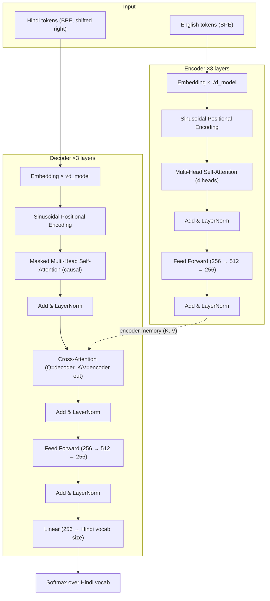

# English → Hindi Neural Machine Translation (Transformer from Scratch)

A sequence-to-sequence **Transformer built from raw `nn.MultiheadAttention` / `nn.LayerNorm` primitives** (no `torch.nn.Transformer`, no HuggingFace) that translates English sentences into Hindi. Implements the full Encoder–Decoder stack, sinusoidal positional encoding, masked self-attention, cross-attention, mixed-precision training, and gradient clipping — trained on a 380K-sentence parallel corpus.

---

## Table of Contents
- [Architecture](#architecture)
- [Configuration](#configuration)
- [Dataset](#dataset)
- [Training Setup](#training-setup)
- [Results: Loss & Perplexity](#results-loss--perplexity)
- [Metrics: What, Why, and What's Missing](#metrics-what-why-and-whats-missing)
- [Sample Translations](#sample-translations)
- [Known Issue: Training Instability](#known-issue-training-instability)
- [Limitations & Future Work](#limitations--future-work)
- [Usage](#usage)
- [Author](#author)

---

## Architecture

Standard Transformer Encoder–Decoder (Vaswani et al., 2017), implemented manually to expose every moving part — attention, masking, residuals, and normalization are all hand-wired rather than delegated to a black-box module.



**Masking:**
- **Source padding mask** — `key_padding_mask` hides `[pad]` tokens from attention so the encoder never attends to filler positions.
- **Target causal mask** — an upper-triangular `-inf` mask on the decoder self-attention, so token *t* can only attend to tokens `≤ t` (prevents the model from "seeing the future" during teacher forcing).

| Component | Value |
|---|---|
| Encoder / Decoder layers | 3 each |
| Attention heads | 4 |
| Model dimension (`d_model`) | 256 |
| Feed-forward hidden dimension | 512 |
| Dropout | 0.1 |
| Positional encoding | Sinusoidal (fixed, not learned) |
| Source / Target vocab | 26,000 / 26,000 (BPE) |
| Total parameters | ~15M *(rough estimate for this config)* |

---

## Configuration

```python
n_heads      = 4
d_model      = 256
hidden_size  = 512
dropout      = 0.1
num_layers   = 3

optimizer    = Adam(lr=5e-4)
loss_fn      = CrossEntropyLoss(ignore_index=<pad>)
scheduler    = ReduceLROnPlateau(factor=0.1, patience=2, mode='min')
batch_size   = 60
epochs       = 15 (planned)
grad_clip    = 1.0
precision    = Mixed Precision (torch.amp, GradScaler)
```

---

## Dataset

| Split | Sentences |
|---|---|
| Train | 380,423 |
| Validation | 9,755 |

- English–Hindi parallel corpus, tokenized separately with two independently trained **Byte Pair Encoding (BPE)** tokenizers (`tokenizer_en.json`, `tokenizer_hi.json`), each with a 26,000-token vocabulary.
- Raw corpus and checkpoints are excluded from version control due to size.
- Decoder input/target are built via the standard **shift-right** trick: `dec_input = trg[:, :-1]`, `label = trg[:, 1:]` — the decoder is trained to predict each token given everything before it (teacher forcing).

---

## Training Setup

- **Loss:** token-level Cross-Entropy, with the `[pad]` index excluded so padding never contributes gradient.
- **Mixed precision (AMP):** forward pass and loss computed in `float16`/`bfloat16` via `torch.amp.autocast`, gradients scaled with `GradScaler` to prevent underflow — cuts memory roughly in half, which matters on a 6GB GPU.
- **Gradient clipping:** global norm clipped to `1.0` before the optimizer step, specifically because Transformers are prone to exploding gradients early in training (deep residual stacks + attention softmax saturation).
- **LR scheduling:** `ReduceLROnPlateau` halves... *(factor 0.1)* the learning rate if validation loss doesn't improve for 2 consecutive epochs.
- **Checkpointing:** the model is saved only when validation loss improves — this is what saved the run in the incident described below.

---

## Results: Loss & Perplexity

Perplexity (`PPL = exp(loss)`) is logged alongside raw cross-entropy loss every epoch, since loss values in isolation (`3.5`, `4.2`) are hard to reason about intuitively.

| Epoch | Train Loss | Train PPL | Val Loss | Val PPL | Notes |
|---|---|---|---|---|---|
| 1 | 4.890 | 132.93 | 4.229 | 68.62 | saved |
| 2 | 4.063 | 58.18 | 3.895 | 49.17 | saved |
| 3 | 3.775 | 43.59 | 3.754 | 42.71 | saved |
| 4 | 3.607 | 36.86 | 3.664 | 39.01 | saved |
| 5 | 3.489 | 32.74 | 3.602 | 36.69 | saved |
| 6 | 3.398 | 29.92 | 3.555 | 34.98 | saved |
| 7 | 3.326 | 27.83 | 3.524 | 33.92 | saved |
| 8 | 3.266 | 26.21 | 3.491 | 32.83 | saved |
| **9** | **NaN** | NaN | **3.474** | **32.25** | **best checkpoint — saved just before divergence** |
| 10 | NaN | NaN | 297.5 | ~10^134 | diverged |
| 11–12 | NaN | NaN | ~298 | ~10^135 | diverged, LR reduced by scheduler, no recovery |

**Best model: Epoch 9 — Validation Loss 3.474 → Validation Perplexity ≈ 32.25**, meaning that, on average, the model's predictive distribution over the 26,000-token Hindi vocabulary was as uncertain as choosing uniformly among ~32 tokens at each position — a reasonable number for a from-scratch 3-layer, 6GB-budget model on 380K sentence pairs (for comparison, well-tuned production NMT systems on large corpora typically land in the single digits to low teens).

---

## Metrics: What, Why, and What's Missing

### Why Cross-Entropy Loss + Perplexity (and not accuracy)
- **Cross-entropy loss** directly optimizes the probability the model assigns to the *correct* next token — it's differentiable and it's what backprop actually uses.
- **Perplexity (`exp(loss)`)** re-expresses that same loss as an interpretable "effective branching factor": *how many equally-likely tokens was the model choosing between, on average?* Lower is better. It's a strictly monotonic transform of the loss, so it adds no new information — it just makes the number human-readable (nobody has intuition for "3.47 nats," but "confused among ~32 options" is legible).
- **Token accuracy** (does `argmax(logits) == label`?) was intentionally *not* used as the primary metric because:
  1. Translation is not single-answer — many valid Hindi phrasings exist for one English sentence, so penalizing a "different but correct" token as wrong is misleading.
  2. Accuracy is binary per token and throws away confidence information. A model that puts 49% probability on the right token and a model that puts 0.01% on it both score "wrong" under accuracy, but they're in very different states of training health — perplexity distinguishes them.
  3. Accuracy under teacher forcing (conditioning on the *true* previous token) doesn't reflect real inference behavior, where the decoder conditions on its *own* previous predictions and errors compound (exposure bias) — this is a limitation shared with perplexity too, see below.

### What perplexity does *not* tell you (be ready to say this in an interview)
Perplexity is an **intrinsic** metric — it only measures how well the model predicts the *reference* sequence, not whether the sentence it actually generates (via greedy/beam decoding) is fluent, grammatically correct, or means the same thing. Two checkpoints with identical perplexity can produce noticeably different translation quality. That's why production MT pipelines always pair perplexity (a training-time health signal) with **extrinsic, generation-based metrics** computed on decoded output:

| Metric | What it measures | Pros | Cons |
|---|---|---|---|
| **BLEU** | n-gram precision overlap with reference(s) | Standard, cheap, widely reported | Insensitive to synonyms/reordering, needs multiple references for fairness, poor correlation with fluency |
| **chrF / chrF++** | Character n-gram F-score | More robust to morphology-rich languages like Hindi than word-level BLEU | Still surface-level, no semantics |
| **TER** (Translation Edit Rate) | Minimum edits to turn output into reference | Intuitive ("how much post-editing?") | Same surface-overlap limitation as BLEU |
| **COMET / BLEURT** | Learned, embedding-based semantic similarity | Correlates much better with human judgment | Needs a pretrained scoring model, heavier compute |
| **Human evaluation (adequacy/fluency)** | Direct judgment | Gold standard | Expensive, slow, not automatable |

**This project currently reports perplexity only** — a natural next step (and a good thing to flag proactively) is to run beam-search decoding on the validation set and report BLEU/chrF alongside perplexity, since perplexity alone can look good while the decoded sentences still have word-order or repetition issues (visible in a few of the sample translations below).

---

## Sample Translations

Generated with greedy decoding + repetition penalty (`penalty=1.2`) from the epoch-9 checkpoint:

| English | Hindi (model output) |
|---|---|
| Hello, how are you? | कैसे हैं ? |
| Where do you live? | तुम कहाँ रहते हो ? |
| I do not like tea. | मुझे चाय पसंद नहीं है । |
| The government is working on a new plan. | सरकार नई योजना बना रही है । |
| Children are playing in the park. | बच्चों को पार्क में बच्चे पार्क में बाल बच रहे हैं । |

The first three are fluent and correct — the fourth (children/park) shows visible **repetition/incoherence** ("park" and "children" duplicated), which is exactly the kind of failure that a low perplexity score can still hide, and is a concrete example to cite when explaining why perplexity alone is insufficient.

---

## Known Issue: Training Instability

Training was configured for 15 epochs but **diverged into NaN loss around epoch 9–10**, despite gradient norm clipping (`clip=1.0`). Validation loss exploded from `3.47` to `~298` (perplexity effectively `10^134`) and never recovered, even after `ReduceLROnPlateau` cut the learning rate.

**Likely causes** (good interview material):
- Gradient clipping was applied *after* `scaler.unscale_(optimizer)` (correct order), but AMP's loss scaling can still let a single bad batch produce `inf`/`NaN` gradients that clipping can't fully neutralize once a `NaN` has propagated into a weight tensor.
- No warm-up schedule on the learning rate — Transformers are known to be sensitive to a "cold start" at full LR (`5e-4`) without linear warm-up, which is standard in the original paper (Noam schedule) but wasn't used here.
- `ReduceLROnPlateau` only reacts *after* damage is already visible in validation loss — it doesn't prevent a mid-epoch collapse.

**What saved the run:** checkpointing on best validation loss meant the epoch-9 weights (before divergence) were preserved and are what `predict_sentence` loads — the final saved model is *not* the last epoch, it's the best one.

**Fix for next iteration:** add LR warm-up (e.g., linear warm-up over the first 4,000 steps as in the original Transformer paper), and/or lower the peak LR, and/or clip more aggressively (e.g., `0.5`).

---

## Limitations & Future Work

- **No extrinsic MT metric (BLEU/chrF/COMET)** is currently computed — only training-time perplexity. Adding beam-search decoding + BLEU/chrF on the validation set is the top priority.
- **Greedy decoding only** at inference; beam search would likely improve fluency, especially on longer sentences.
- **No LR warm-up**, which is the probable root cause of the epoch-9 divergence.
- **Exposure bias**: teacher forcing during training doesn't match autoregressive generation at inference — scheduled sampling or sequence-level training (e.g., minimum risk training) would help close this gap.
- **Single-reference evaluation**: even once BLEU is added, one reference per sentence underestimates quality, since Hindi permits many valid phrasings.

---

## Usage

```bash
python final_code.py
```
If `transformer_model.pt` already exists, it is loaded automatically instead of retraining.

```python
predict_sentence(
    "My father is a very good man",
    model,
    device,
    temperature=1.0,
    penalty=1.5
)
```

---

## Author

**Shrestha Kumar**
